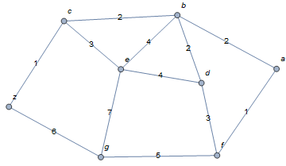

# python-dijkstra
Dijkstra's algorithm is an algorithm for finding the shortest paths between nodes in a weighted graph.

## Contents

* [How to use dijksta module?](#How-to-use-dijksta-module?)
  * [Find all distances and paths](#Find-all-distances-and-paths)
  * [Find the shortest path](#Find-the-shortest-path)
  * [Find the shortest distance](#Find-the-shortest-distance)
* [Drawing graphs](#Drawing-graphs)


# How to use dijksta module?
You must show your graph as an adjacency matrix. For example, notice this graph with its adjacency matrix:




Notice that using python's indexing you get a = 0, b = 1 ... g = 6, z = 7

Download [dijkstra.py](https://github.com/crixodia/python-dijkstra/blob/master/dijkstra.py) module and copy this in your workspace

## Find all distances and paths
```python
dijkstra.find_all(wmat, start, end=-1):
```

Returns a tuple with a distances' list and paths' list of all remaining vertices with the same indexing.

        (distances, paths)

For example, distances[x] are the shortest distances from x vertex which shortest path is paths[x]. x is an element of {0, 1, ..., n-1} where n is the number of vertices

    Args:
    wmat    --  weighted graph's adjacency matrix
    start   --  paths' first vertex
    end     --  (optional) path's end vertex. Return just the 
                distance and its path

    Exceptions:
    Index out of range, Be careful with start and end vertices.

### Example code
```python
import dijkstra # Import the module

# Weighted adjacency matrix
wmat = [[0, 2, 0, 0, 0, 1, 0, 0],
        [2, 0, 2, 2, 4, 0, 0, 0],
        [0, 2, 0, 0, 3, 0, 0, 1],
        [0, 2, 0, 0, 4, 3, 0, 0],
        [0, 4, 3, 4, 0, 0, 7, 0],
        [1, 0, 0, 3, 0, 0, 5, 0],
        [0, 0, 0, 0, 7, 5, 0, 6],
        [0, 0, 1, 0, 0, 0, 6, 0]]

print(dijkstra.find_all(wmat, 0))
```
Output:
```
([0, 2, 4, 4, 6, 1, 6, 5], [[0], [0, 1], [0, 1, 2], [0, 5, 3], [0, 1, 4], [0, 5], [0, 5, 6], [0, 1, 2, 7]])
```

## Find the shortest path
```python
dijkstra.find_shortest_path(wmat, start, end=-1):
```
Returns paths' list of all remaining vertices.

    Args:
    wmat    --  weighted graph's adjacency matrix
    start   --  paths' first vertex
    end     --  (optional) path's end vertex. Return just
                the path

    Exceptions:
    Index out of range, Be careful with start and end vertices.

### Example code with final vertex
```python
import dijkstra # Import the module

# Weighted adjacency matrix
wmat = [[0, 2, 0, 0, 0, 1, 0, 0],
        [2, 0, 2, 2, 4, 0, 0, 0],
        [0, 2, 0, 0, 3, 0, 0, 1],
        [0, 2, 0, 0, 4, 3, 0, 0],
        [0, 4, 3, 4, 0, 0, 7, 0],
        [1, 0, 0, 3, 0, 0, 5, 0],
        [0, 0, 0, 0, 7, 5, 0, 6],
        [0, 0, 1, 0, 0, 0, 6, 0]]

print(dijkstra.find_shortest_path(wmat, 0, 7))
```
Output:
```
[0, 1, 2, 7]
```
### Example code without final vertex
```python
import dijkstra # Import the module

# Weighted adjacency matrix
wmat = [[0, 2, 0, 0, 0, 1, 0, 0],
        [2, 0, 2, 2, 4, 0, 0, 0],
        [0, 2, 0, 0, 3, 0, 0, 1],
        [0, 2, 0, 0, 4, 3, 0, 0],
        [0, 4, 3, 4, 0, 0, 7, 0],
        [1, 0, 0, 3, 0, 0, 5, 0],
        [0, 0, 0, 0, 7, 5, 0, 6],
        [0, 0, 1, 0, 0, 0, 6, 0]]

print(dijkstra.find_shortest_path(wmat, 0))
```
Output:
```
[[0], [0, 1], [0, 1, 2], [0, 5, 3], [0, 1, 4], [0, 5], [0, 5, 6], [0, 1, 2, 7]]
```

## Find the shortest distance
```python
dijkstra.find_shortest_distance(wmat, start, end=-1):
```
Returns distances' list of all remaining vertices.

    Args:
    wmat    --  weighted graph's adjacency matrix
    start   --  paths' first vertex
    end     --  (optional) path's end vertex. Return just
                the distance

    Exceptions:
    Index out of range, Be careful with start and end vertices.

### Example code with final vertex
```python
import dijkstra # Import the module

# Weighted adjacency matrix
wmat = [[0, 2, 0, 0, 0, 1, 0, 0],
        [2, 0, 2, 2, 4, 0, 0, 0],
        [0, 2, 0, 0, 3, 0, 0, 1],
        [0, 2, 0, 0, 4, 3, 0, 0],
        [0, 4, 3, 4, 0, 0, 7, 0],
        [1, 0, 0, 3, 0, 0, 5, 0],
        [0, 0, 0, 0, 7, 5, 0, 6],
        [0, 0, 1, 0, 0, 0, 6, 0]]

print(dijkstra.find_shortest_distance(wmat, 0, 7))

```
Output:
```
5
```

### Example code without final vertex
```python
import dijkstra # Import the module

# Weighted adjacency matrix
wmat = [[0, 2, 0, 0, 0, 1, 0, 0],
        [2, 0, 2, 2, 4, 0, 0, 0],
        [0, 2, 0, 0, 3, 0, 0, 1],
        [0, 2, 0, 0, 4, 3, 0, 0],
        [0, 4, 3, 4, 0, 0, 7, 0],
        [1, 0, 0, 3, 0, 0, 5, 0],
        [0, 0, 0, 0, 7, 5, 0, 6],
        [0, 0, 1, 0, 0, 0, 6, 0]]

print(dijkstra.find_shortest_distance(wmat, 0))
```

Output:
```
[0, 2, 4, 4, 6, 1, 6, 5]
```
# Drawing graphs

To get a visual representation using the adjacency matrix, you can use the next module [draw_graph.py](https://github.com/crixodia/python-dijkstra/blob/master/draw_graph.py)
```python
draw_graph.undirected_graph(wmat, name="weighted_undirected_graph")
```
Creates a pdf file with the weigthted graph's visualization. You must have installed graphviz (Python conector and OS compilation)

OS: https://www.graphviz.org/

Python module: https://graphviz.readthedocs.io/en/stable/index.html

    Args:
    wmat  --  weigthted graph's adjacency matrix
    name  --  (optional) graph's filenma

### Example code

```python
import draw_graph # Import the module

# Weighted adjacency matrix
wmat = [[0, 2, 0, 0, 0, 1, 0, 0],
        [2, 0, 2, 2, 4, 0, 0, 0],
        [0, 2, 0, 0, 3, 0, 0, 1],
        [0, 2, 0, 0, 4, 3, 0, 0],
        [0, 4, 3, 4, 0, 0, 7, 0],
        [1, 0, 0, 3, 0, 0, 5, 0],
        [0, 0, 0, 0, 7, 5, 0, 6],
        [0, 0, 1, 0, 0, 0, 6, 0]]

print(draw_graph.undirected_graph(wmat))
```

Output file: [wmat.pdf](https://github.com/crixodia/python-dijkstra/blob/master/wmat.pdf)